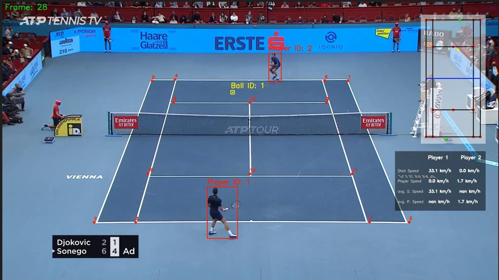
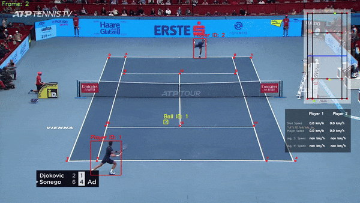

<h2 align="center">Tennis Analysis using YOLO and CNNsn</h2>

<div align= "center">
  <h5>This project analyzes Tennis players in a video to measure their speed, ball shot speed and number of shots. This project will detect players and the tennis ball using YOLO and also utilizes CNNs to extract court keypoints.</h5>
</div>

<div align="center">
    <a href="https://www.python.org/"></a>
    
    
    
    <a href="https://github.com/Chaganti-Reddy/Tennis-Analysis-YOLOV8/issues"></a>
</div>

## :innocent: Motivation

The motivation behind this project to analyze tennis players in a video to measure their speed, ball shot speed and number of shots, so that the analysis can be used to improve the performance of the players. Not only that, it also helps for the coaches to analyze the performance of the players and provide feedback to the players. And to make the judgement for referees easier.

## Table of Contents

- [:star: Features](#star-features)
- [:warning: Frameworks and Libraries](#warning-frameworks-and-libraries)
- [:file_folder: Datasets](#file_folder-datasets)
- [📂 Directory Tree](#-directory-tree)
- [:bulb: Models Used](#bulb-models-used)
- [🚀&nbsp; Installation & Running](#nbsp-installation--running)
- [:key: Results](#key-results)
- [:raising_hand: Citation](#raising_hand-citation)
- [:beginner: Future Goals](#beginner-future-goals)
- [:eyes: License](#eyes-license)

## :star: Features

- **Player Detection**: Detects players in the video using YOLO Models.
- **Tennis Ball Detection**: Detects tennis ball in the video continuously.
- **Court Key Point Extraction**: Extracts court keypoints using CNNs.
- **Speed Measurement**: Measures the speed of the players and the tennis ball.
- **Shot Count**: Counts the number of shots played by the players.

## :warning: Frameworks and Libraries

- **[YOLO](https://github.com/ultralytics/ultralytics)** - YOLO is a state-of-the-art, real-time object detection system. It is a deep learning algorithm that can detect objects in real-time. YOLO is a clever neural network for doing object detection in real-time. YOLO stands for 'You Only Look Once'.
- **[PyTorch](https://pytorch.org/)** - PyTorch is an open source machine learning library based on the Torch library. It is used for applications such as natural language processing. It is primarily developed by Facebook's AI Research lab.
- **[OpenCV](https://opencv.org/)** - OpenCV is a library of programming functions mainly aimed at real-time computer vision. Originally developed by Intel, it was later supported by Willow Garage then Itseez. The library is cross-platform and free for use under the open-source BSD license.
- **[CNNs](https://en.wikipedia.org/wiki/Convolutional_neural_network)** - In deep learning, a convolutional neural network (CNN, or ConvNet) is a class of deep neural networks, most commonly applied to analyzing visual imagery.

## :file_folder: Datasets

The DataSet used for this project is mainly to extract the court keypoints & to improve the ball tracking, for that we collected the data from [Roboflow](https://public.roboflow.com/).

## 📂 Directory Tree

```bash
├── analysis
├── constants
├── court_line_detector
├── input_videos
├── mini_court
├── output_videos
├── runs
│   └── detect
│       ├── predict
│       ├── predict2
│       ├── predict3
│       ├── predict4
│       └── track
├── trackers
├── tracker_stubs
├── training
│   └── tennis-ball-detection-6
│       └── tennis-ball-detection-6
│           ├── test
│           │   ├── images
│           │   └── labels
│           ├── train
│           │   ├── images
│           │   └── labels
│           └── valid
│               ├── images
│               └── labels
└── utils

```

## :bulb: Models Used

- YOLO v8 for player detection
- Fine Tuned YOLO for tennis ball detection
- Court Key point extraction

## 🚀&nbsp; Installation & Running

1. Clone the repository and navigate to the directory

```bash
git clone https://github.com/Chaganti-Reddy/Tennis-Analysis-YOLOV8.git && cd Tennis-Analysis-YOLOV8
```

2. Change the path of video file to be analyzed in the [main.py](main.py) file.

3. Install these requirements.

- python3.8
- ultralytics
- pytroch
- pandas
- numpy
- opencv

4. Then run the following command to run the application.

```bash
python main.py
```

## :key: Results

The results of the project will be saved in the output_videos folder. The output video will contain the following:

<div align= "center">
</div>

## :clap: And it's done!

Feel free to mail me for any doubts/query
:email: [Mail to Me :smile:](chagantivenkataramireddy1@gmail.com)

---

## :raising_hand: Citation

You are allowed to cite any part of the code or our dataset. You can use it in your Research Work or Project. Remember to provide credit to the Maintainer Chaganti Venkatarami Reddy by mentioning a link to this repository and her GitHub Profile.

Follow this format:

- Author's name - Name
- Date of publication or update in parentheses.
- Title or description of document.
- URL.

## :beginner: Future Goals

1. To improve the accuracy of the ball tracking.
2. To improve the efficiency of the player detection.
3. To improve the accuracy of the court keypoints extraction.
4. To add more features like player speed measurement, ball speed measurement and shot count.

## :eyes: License

MIT © [Chaganti Reddy](https://github.com/Chaganti-Reddy/Tennis-Analysis-YOLOV8/blob/main/LICENSE)
